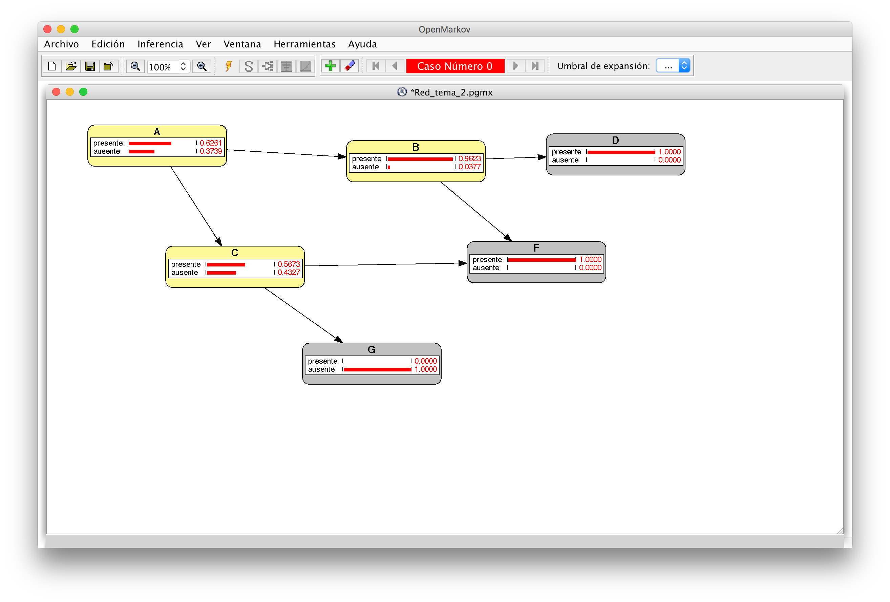

Queremos calcular la siguiente probabilidad utilizando el método de **fuerza bruta**:

$$
P(a|+d, +f, \neg g)
$$

Aplicando la definición de probabilidad condicionada tenemos que 

$$
P(a|+d, +f, \neg g) = \frac{P(a, +d, +f, \neg g)}{P(+d, +f, \neg g)}
$$

Ahora bien, como la variable aleatoria $A$ solo puede tomar dos valores $+a$ y $\neg a$, bastará calcular la probabilidad anterior para el valor $+a$ ya que

$$
P(\neg a|+d, +f, \neg g) = 1- P(+a|+d, +f, \neg g)
$$

Tenemos que

$$
P(+a, +d, +f, \neg g) = \sum_b \sum_c P(+a, b, c, +d, +f, \neg g)
$$

y también que

$$
P(+d, +g, \neg g) = \sum_a\sum_b \sum_c P(a, b, c, +d, +g, \neg g)
$$

Por construcción de la red bayesiana, la probabilidad conjunta se puede expresar como:

$$
p(a, b, c, d, f, g) = p(a) \cdot p(b|a) \cdot p(c|a) \cdot p(g|c) \cdot p(f|c, b) \cdot p(d|b)
$$

Sabiendo esto, podemos obtener los cálculos:

$$
\begin{split}
P(+a, +b, +c, +d, +f, \neg g) &= p(+a) \cdot p(+b|+a) \cdot p(+c|+a) \cdot p(\neg g|+c) \cdot p(+f|+c, +b) \cdot p(+d|+b) \\
&= 0.3 \cdot 0.9 \cdot 0.75 \cdot 0.6 \cdot 0.8 \cdot 0.6 \\
&= 0.05832
\end{split}
$$

$$
\begin{split}
P(\neg a, +b, +c, +d, +f, \neg g) &= p(\neg a) \cdot p(+b|\neg a) \cdot p(+c|\neg a) \cdot p(\neg g|+c) \cdot p(+f|+c, +b) \cdot p(+d|+b) \\
&= 0.7 \cdot 0.2 \cdot 0.25 \cdot 0.6 \cdot 0.8 \cdot 0.6 \\
&= 0.01008
\end{split}
$$

$$
\begin{split}
P(+a, \neg b, +c, +d, +f, \neg g) &= p(+a) \cdot p(\neg b|+a) \cdot p(+c|+a) \cdot p(\neg g|+c) \cdot p(+f|+c, \neg b) \cdot p(+d|\neg b) \\
&= 0.3 \cdot 0.1 \cdot 0.75 \cdot 0.6 \cdot 0.5 \cdot 0.1 \\
&= 0.000675
\end{split}
$$

$$
\begin{split}
P(\neg a, \neg b, +c, +d, +f, \neg g) &= p(\neg a) \cdot p(\neg b|\neg a) \cdot p(+c|\neg a) \cdot p(\neg g|+c) \cdot p(+f|+c, \neg b) \cdot p(+d|\neg b) \\
&= 0.7 \cdot 0.8 \cdot 0.25 \cdot 0.6 \cdot 0.5 \cdot 0.1 \\
&= 0.0042
\end{split}
$$

$$
\begin{split}
P(+a, +b, \neg c, +d, +f, \neg g) &= p(+a) \cdot p(+b|+a) \cdot p(\neg c|+a) \cdot p(\neg g|\neg c) \cdot p(+f|\neg c, +b) \cdot p(+d|+b) \\
&= 0.3 \cdot 0.9 \cdot 0.25 \cdot 0.9 \cdot 0.6 \cdot 0.6 \\
&= 0.02187
\end{split}
$$

$$
\begin{split}
P(+a, \neg b, \neg c, +d, +f, \neg g) &= p(+a) \cdot p(\neg b|+a) \cdot p(\neg c|+a) \cdot p(\neg g|\neg c) \cdot p(+f|\neg c, \neg b) \cdot p(+d|\neg b) \\
&= 0.3 \cdot 0.1 \cdot 0.25 \cdot 0.9 \cdot 0 \cdot 0.1 \\
&= 0
\end{split}
$$

$$
\begin{split}
P(\neg a, +b, \neg c, +d, +f, \neg g) &= p(\neg a) \cdot p(+b|\neg a) \cdot p(\neg c|\neg a) \cdot p(\neg g|\neg c) \cdot p(+f|\neg c, +b) \cdot p(+d|+b) \\
&= 0.7 \cdot 0.2 \cdot 0.75 \cdot 0.9 \cdot 0.6 \cdot 0.6 \\
&= 0.03402
\end{split}
$$

$$
\begin{split}
P(\neg a, \neg b, \neg c, +d, +f, \neg g) &= p(\neg a) \cdot p(\neg b|\neg a) \cdot p(\neg c|\neg a) \cdot p(\neg g|\neg c) \cdot p(+f|\neg c, \neg b) \cdot p(+d|\neg b) \\
&= 0.7 \cdot 0.8 \cdot 0.75 \cdot 0.9 \cdot 0 \cdot 0.1 \\
&= 0
\end{split}
$$

Ahora podemos calcular los siguientes sumandos:

$$
P(+a, +d, +g, \neg g) = \sum_b \sum_c P(+a, b, c, +d, +g, \neg g) = 0.05832 + 0.000675 + 0.02187 + 0 = 0.080865
$$

$$
P(\neg a, +d, +g, \neg g) = \sum_b \sum_c P(+a, b, c, +d, +g, \neg g) = 0.01008 + 0.0042 + 0.03402 + 0 = 0.0483
$$

Por tanto,

$$
P(+d, +f, \neg g) = \sum_a\sum_b \sum_c P(a, b, c, +d, +f, \neg g) = \sum_a P(a, +f, +g, \neg g) = 0.080865 + 0.0483 = 0.129165
$$

Así, llegamos a que

$$
P(+a|+d, +f, \neg g) = \frac{P(a, +d, +f, \neg g)}{P(+d, +f, \neg g)} = \frac{0.080865}{0.129165} = 0.6260597
$$

Y, de la misma forma,

$$
P(\neg a|+d, +f, \neg g) = 1 - P(+a|+d, +f, \neg g)  = 1 - 0.6260597 = 0.3739403
$$

Podemos realizar estos mismo cálculos ayudándonos del programa OpenMarkov tal y como se muestra en la siguiente imagen:

En la imagen se muestra que los cálculos realizados mediante fuerza bruta corresponden con los de OpenMarkov.

# Método de eliminación de variables

En este caso vamos a utilizar para calcular la probabilidad
$$
P(a|+d, +f, \neg g)
$$

el método de eliminación de variables.

Para ello

$$
\begin{split}
P(a, +d, +f, \neg g) &= \sum_b \sum_c P(a, b, c, +d, +f, \neg g) \\
&= \sum_b \sum_c p(a) \cdot p(b|a) \cdot p(c|a) \cdot p(\neg g|c) \cdot p(+f|c, b) \cdot p(+d|b) 
\end{split}
$$

Comenzamos obteniendo el potencial que dependa de la variable $B$:

$$
\psi_1(a, c) = \sum_b p(b|a)\cdot p(+f|c,b)\cdot p(+d|b)
$$

Ahora eliminamos la variable $C$:
$$
\psi_2(a) = \sum_c p(c|a) \cdot p(\neg g|c) \psi_1(a, c)
$$
Luego el cálculo de la probabilidad se reduce a

$$
P(a, +d, +f, \neg g) = p(a) \psi_2(a)
$$

Ahora realicemos los cálculos numéricos:

$$
\begin{split}
\psi_1(+a, +c) &= \sum_b p(b|a)\cdot p(+f|c,b)\cdot p(+d|b) \\
&= p(+b|+a)\cdot p(+f|+c,+b)\cdot p(+d|+b) + p(\neg b|+a)\cdot p(+f|+c,\neg b)\cdot p(+d|\neg b) \\
&= 0.9 \cdot 0.8\cdot 0.6 + 0.1\cdot 0.5 \cdot 0.1 \\
&= 0.437 
\end{split}
$$

$$
\begin{split}
\psi_1(+a, \neg c) &= \sum_b p(b|a)\cdot p(+f|c,b)\cdot p(+d|b) \\
&= p(+b|+a)\cdot p(+f|\neg c,+b)\cdot p(+d|+b) + p(\neg b|+a)\cdot p(+f|\neg c,\neg b)\cdot p(+d|\neg b) \\
&= 0.9 \cdot 0.6\cdot 0.6 + 0.1\cdot 0 \cdot 0.1 \\
&= 0.324
\end{split}
$$

$$
\begin{split}
\psi_1(\neg a, +c) &= \sum_b p(b|a)\cdot p(+f|c,b)\cdot p(+d|b) \\
&= p(+b|\neg a)\cdot p(+f|+c,+b)\cdot p(+d|+b) + p(\neg b|\neg a)\cdot p(+f|+c,\neg b)\cdot p(+d|\neg b) \\
&= 0.2 \cdot 0.8\cdot 0.6 + 0.8\cdot 0.5 \cdot 0.1 \\
&= 0.136
\end{split}
$$

$$
\begin{split}
\psi_1(\neg a, \neg c) &= \sum_b p(b|a)\cdot p(+f|c,b)\cdot p(+d|b) \\
&= p(+b|\neg a)\cdot p(+f|\neg c,+b)\cdot p(+d|+b) + p(\neg b|\neg a)\cdot p(+f|\neg c,\neg b)\cdot p(+d|\neg b) \\
&= 0.2 \cdot 0.6\cdot 0.6 + 0.8\cdot 0 \cdot 0.1 \\
&= 0.072
\end{split}
$$

Por otro lado, 
$$
\begin{split}
\psi_2(+a) &= \sum_c p(c|+a) \cdot p(\neg g|c) \psi_1(+a, c) \\
&= p(+c|+a) \cdot p(\neg g|+c) \psi_1(+a, +c) + p(\neg c|+a) \cdot p(\neg g|\neg c) \psi_1(+a, \neg c) \\
&= 0.75 \cdot 0.6 \cdot 0.437  + 0.25 \cdot 0.9 \cdot 0.324 \\
&= 0.26955
\end{split}
$$
$$
\begin{split}
\psi_2(\neg a) &= \sum_c p(c|\neg a) \cdot p(\neg g|c) \psi_1(\neg a, c) \\
&= p(+c|\neg a) \cdot p(\neg g|+c) \psi_1(\neg a, +c) + p(\neg c|\neg a) \cdot p(\neg g|\neg c) \psi_1(\neg a, \neg c) \\
&= 0.25 \cdot 0.6 \cdot 0.136  + 0.75 \cdot 0.9 \cdot 0.072 \\
&= 0.069
\end{split}
$$

Por tanto,

$$
P(+a, +d, +f, \neg g) = p(+a) \psi_2(+a) = 0.3 \cdot 0.26955 = 0.080865
$$

$$
P(\neg a, +d, +f, \neg g) = p(\neg a) \psi_2(\neg a) = 0.7 \cdot 0.069 = 0.0483
$$

Así,
$$
P( +d, +f, \neg g) = \sum_a P(a, +d, +f, \neg g) = 0.080865 + 0.0483 = 0.129165
$$
y, llegamos al mismo resultado que aplicando el método de fuerza bruta:

$$
P(+a|+d, +f, \neg g) = \frac{P(a, +d, +f, \neg g)}{P(+d, +f, \neg g)} = \frac{0.080865}{0.129165} = 0.6260597
$$
$$
P(\neg a|+d, +f, \neg g) = 1 - P(+a|+d, +f, \neg g) = 1 - 0.6260597 = 0.3739403
$$
